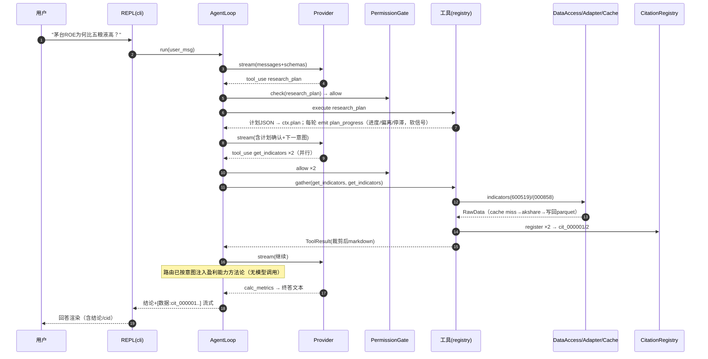
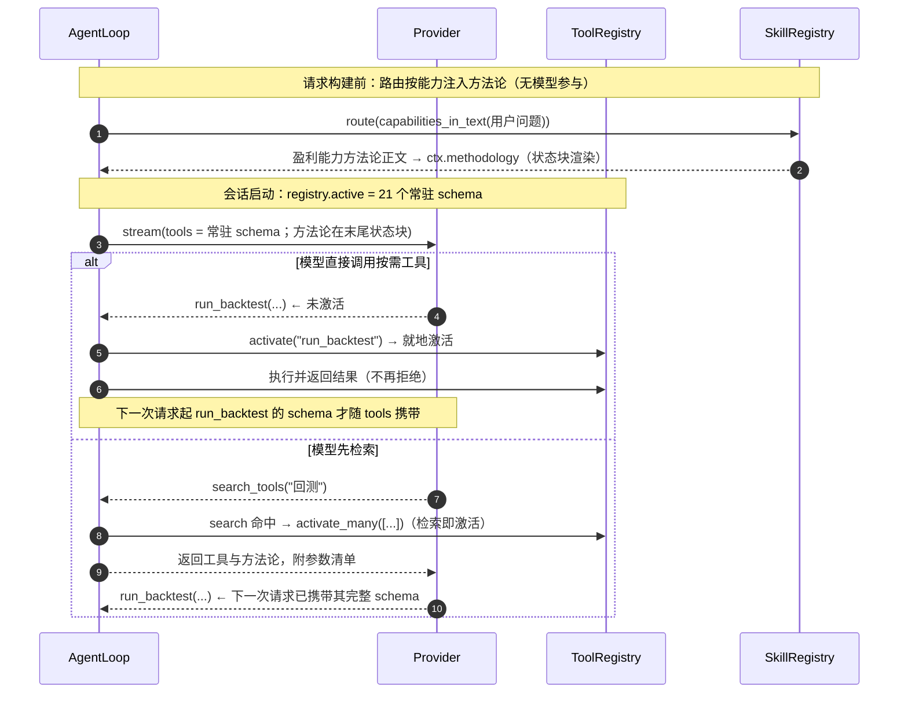
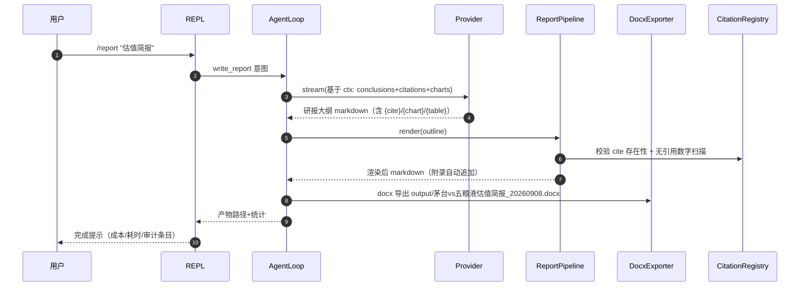
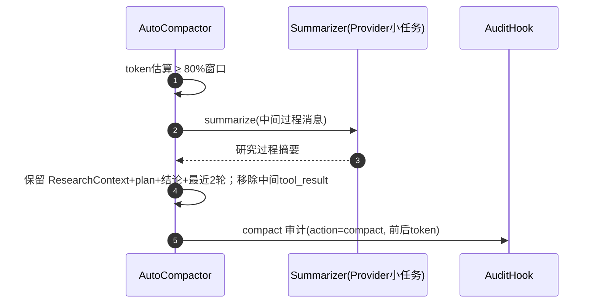
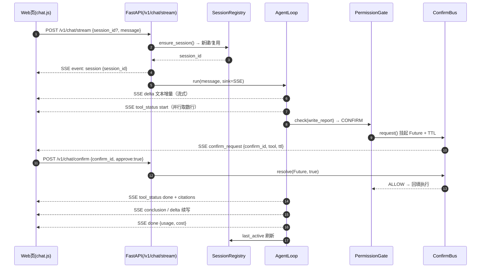

# FinHarness —— 系统架构与模块详细设计

> 版本 v1.1 · 2026-09-08
> 修订 v1.1：新增 **FastAPI HTTP/SSE 服务层与简易 Web 聊天页**，与 CLI/REPL 双入口并存、共享同一引擎（详见 §3.12、§5.5、M6）
> 配套文档：[FinHarness投研Copilot设计方案 v1.1](./FinHarness投研Copilot设计方案.md)
> 本文档定位：在 v1.1 方案已锁定的产品形态与分层框架之下，给出**可进入编码的架构级与模块级详细设计**——接口签名、数据结构、算法流程、Schema、时序、容错与测试策略。实现者无需再在本层做方向性决策。

---

## 0. 文档说明

### 0.1 目标与范围

- **输入**：v1.1 方案（双模式、分层 Harness、约 24 能力 + 8 Skills、5 个里程碑——本版扩展为 M0–M6）。
- **输出**：① 系统总体架构（分层、运行时、依赖规则、关键决策）；② 每个模块的详细设计（类型/接口/算法/流程）；③ 存储与 Schema 设计；④ 时序、错误容错、安全、测试、上下文预算；⑤ 里程碑 WBS。
- **不含**：具体 UI 稿、盈利模型、运维部署。

### 0.2 与 v1.1 的口径修正（裁定说明）

v1.1 中工具数量存在几处不精确（架构图"12 金融+5 通用" vs 工具清单"8+4+2+4+5"），且"懒加载按需注册"缺少**激活入口**。本文档做如下裁定，后续所有数字以此为准：

| # | 裁定 | 依据 |
|---|---|---|
| 1 | **工具总集 = 32**：金融-数据 12 + 金融-计算 3 + 金融-输出 2 + 通用 4 + 元 11（后续新增见 §3.4.1 权威表） | 统一口径 |
| 2 | **元工具 = 11**：`research_plan / update_plan_step / record_conclusion / search_tools / spawn_agent / summarize_document / ask_user / remember_preference / search_memory / update_memory / forget_memory`（后三个是 LTM 跨对话记忆的检索与治理，见 §3.6.4「4.1」）。原 `load_tool` / `load_skill` / `list_skills` 已删除——加载不是模型该问的问题（见 ADR-11） | §3.4.1 |
| 3 | **常驻 = 21，按需 = 8**：按需池 = `get_announcements / calc_valuation / web_search / get_research_reports / spawn_agent / read_pdf / summarize_document / run_backtest`（低频或重 IO/重计算）。层级由 `@tool(tier=...)` 声明 | token 预算（见 §9） |
| 4 | **工具元数据与参数由 `@tool`/`@param` 声明**：能力、层级、分组、权限、参数描述同处一地；参数的类型与默认值取自 `_dispatch` 签名，故声明与实现不可能漂移 | 消灭三份手工映射（能力表/懒加载清单/settings 名单） |
| 5 | **`make_chart` 归 read 级**（自动放行）：其产物写入隔离目录 `output/`，不触碰用户数据；`write_file`（非 output 目录）/`write_report` 归 write 级 | 统一 §3.3 与 §3.6 的冲突 |
| 6 | **`run_python` 归 write 级 + 沙箱白名单**：Default/Plan 需确认，Auto 放行，但代码一律经 import 白名单与 deny 扫描 | 任代码即危险面 |

### 0.3 符号约定

- `Pydantic v2` 类型 = 数据契约；`async` = 唯一 I/O 风格（asyncio 单进程事件循环）。
- 代码块仅描述契约/流程，不承诺最终实现行级一致；实现遵循用户规则（标识符英文、函数前置注释、复杂块注释）。
- 所有时间戳统一 `UTC+8`，格式 `YYYY-MM-DD HH:MM:SS`。

---

## 1. 总体架构设计

### 1.1 逻辑分层（组件级）

```
┌─────────────────────────────────────────────────────────────────────────┐
│ L1 接口层  cli.py + server/(FastAPI) + static Web 页面                    │
│   · fin：问答 REPL · fin report 研报流水线 · fin serve 启动服务          │
│   · HTTP：POST /v1/chat/stream(SSE) · 会话/确认/查询子接口 · Web 聊天页   │
│   · 双入口共享同一 composition root（engine/治理/数据/上下文）            │
├─────────────────────────────────────────────────────────────────────────┤
│ L2 治理层  permissions/ + hooks/                                         │
│   · PermissionGate（read=自动 write=确认 deny=拒绝；确认经 ConfirmBus）   │
│   · SandboxScanner（run_python 白名单+deny_patterns 命中扫描）           │
│   · HookChain：PreToolUse → Tool → PostToolUse（审计强制落盘）           │
├─────────────────────────────────────────────────────────────────────────┤
│ L3 能力层  tools/ + skills/                                              │
│   · @tool/@param 声明 → ToolRegistry（常驻 / 按需两级）                  │
│   · 元工具族：research_plan / search_tools / ask_user / …               │
│   · Skills：4 个投研场景包（SKILL.md 流程 + references 方法论 + assets 报告模板）│
│     由路由层按意图注入（不提供加载工具，见 ADR-11）                      │
├─────────────────────────────────────────────────────────────────────────┤
│ L4 核心层  engine/ + context/                                            │
│   · AgentLoop（流式 turn / 并行工具 / 治理执行链 / 成本累计）             │
│   · ContextAssembler（history+system+schemas 组装）                      │
│   · trim 裁剪管线 + ResearchContext 会话状态                             │
│   · AutoCompactor（80% 阈值，保留 ResearchContext/计划/结论）            │
├─────────────────────────────────────────────────────────────────────────┤
│ L5 数据与产出  data/ + coordinator/（研报管道在 tools/fin/，utils/ 承跨层件）│
│   · DataAdapter（多源防腐层，按 settings.data.adapter_order 顺序降级；        │
│     现为 fuyao 同花顺 → akshare → …，另有 tavily / eastmoney_report）        │
│   · LocalCache（SQLite 索引 + parquet 数据体）                           │
│   · CitationRegistry（引用溯源注册表，数据零幻觉根基）                   │
│   · ReportPipeline（模板渲染 / cite+chart 注入 / docx 导出）            │
├─────────────────────────────────────────────────────────────────────────┤
│ L6 模型层  provider/                                                     │
│   · Provider 抽象 + AnthropicCompat + OpenAICompat（直连 httpx）         │
│   · ProviderRegistry 按 settings 选择厂商与端点                           │
└─────────────────────────────────────────────────────────────────────────┘
        依赖方向：仅允许上层依赖下层；L1 内部 cli 与 server 各自独立
        (都是 L4-L6 的薄门面，互不依赖)；同一层内 data/tools 解耦通过基类
```

### 1.2 运行时拓扑（进程模型）

- **单进程 asyncio**。进程内一个事件循环承载：REPL 输入协程、Provider 流式协程、并行工具执行任务组。无消息队列、无守护进程。
- **会话（Session）范围**：一次 `fin` 进程 = 一个会话。会话内对象：`ResearchContext`、记忆 L1/L2（`WorkingMemory` + `ShortTermMemory`，见 §3.6.4）、`CitationRegistry`、`LocalCache(共享实例)`、`AuditLogWriter`、`Settings`。进程退出时会话对象随内存回收；持久化产物只有：`data_cache/`（缓存 + L3 长期记忆 `memory.db`）、`logs/audit.jsonl`（审计）、`output/`（研报与图表）、`MEMORY.md`（L3 只读渲染视图）。
- **并发单元**：AgentLoop 每轮工具执行 = `asyncio.gather` 的 Task 组；单工具内部带超时（`asyncio.wait_for`）。数据层全部 async 包装（akshare/tushare 同步库 → `run_in_executor` 线程池隔离，避免阻塞循环）。
- **两种运行形态（同一 codebase）**：
  - `fin`：CLI 进程，交互（REPL）或非交互（report），退出即会话结束。
  - `fin serve`：FastAPI 服务进程（uvicorn 单 worker 即可），常驻；会话服务端内存化，由 `SessionRegistry` 管理生命周期（idle 超时回收，默认 30min）；CLI 与 Server 经由同一 `session_deps.py` 组装依赖，语义完全一致。

### 1.3 一次完整问答的数据流（复杂分析题）

```
User → REPL
  → AgentLoop.run(user_msg)        # 内部首步：ctx.append_user(user_msg)
       build_request(messages + active_tool_schemas + system_prompt)
       → Provider.stream() → 解析 tool_use / 终答
       → 若 tool_use：
            PermissionGate.allow(tool)？
              ├─ deny      → 结构化错误回填（解释被拒原因）
              ├─ write确认 → CLI y/n → 回填用户决定
              └─ 通过       → HookChain.pre(tool,args)
                              → execute_with_governance(tool)  [超时]
                                   ├─ 命中 LocalCache → 直接返回
                                   └─ DataAdapter(akshare) → 失败自动降级 tushare
                              → CitationRegistry.register(结果→citation_id)
                              → HookChain.post(审计落盘)
                              → trim_results() 裁剪 → append(tool_result)
       → 循环直至 stop_reason=end / 达到 max_turns
  → 若需成稿：write_report → ReportPipeline → output/*.docx

注：CLI 与 HTTP 只差"输出端(OutputSink)"——rich 终端渲染 vs SSE 事件编组；
AgentLoop 内部事件(文本增量/工具状态/计划/结论/确认请求)统一走 OutputSink 抽象。
```

### 1.4 关键架构决策（ADR-lite）

| ID | 决策 | 备选 | 理由 |
|---|---|---|---|
| ADR-1 | 单进程 asyncio，子智能体同进程独立上下文 | 多进程/微服务 | 轻量、可演示、无部署负担；多智能体仅阶段二演示级 |
| ADR-2 | plan-and-execute 实现为"单一 `research_plan` 工具 + 系统提示意图路由" | LangGraph 状态机 / 单独 planner 进程 | v1.1 §3.2 的核心理由：不改 Loop，模型自主决策，简洁可讲 |
| ADR-3 | ~~懒加载工具"两段式激活"（search→load_tool），Skills 经 load_skill 注入~~ **已被 ADR-11 取代** | 预注入全部 schema | 模型只能调用已注入 schema 的工具，必须显式激活；控 token |
| ADR-4 | 结果裁剪发生在**入上下文前**，完整数据落 parquet 供 `read_file` 精读 | 全量入上下文 | v1.1 §3.5：~50K token → ~1K |
| ADR-5 | 审计为"强制 hook + JSONL 追加"，无开关 | 可关闭审计 | 投研留痕是产品卖点，永不关闭 |
| ADR-6 | 数据访问收敛到 DataAdapter，按 `settings.data.adapter_order` 顺序降级（现默认 fuyao → akshare） | 直接调用 ak | akshare 上游频繁改版，防腐层是工程亮点；顺序即优先级，故新增源要按"谁更懂这个数据域"排 |
| ADR-7 | Provider 直连 HTTP（httpx + SSE），不依赖 anthropic/openai 官方 SDK | 官方 SDK | 便于兼容 Kimi/GLM/DeepSeek 多端点，体现代码功底 |
| ADR-8 | 记忆分层（§3.6.4）：L1 工作/L2 短期在内存（`list[Msg]`/事件环）；对话内持久化为 SQLite `memory.db`；**跨对话长期记忆 = `ltm_episodes` 情节表 + `ltm_facts` 语义表（按 `user_id` 作用域；情节 task_result 每轮结构化写入 + decision/excerpt 懒蒸馏，语义与偏好同一次调用产出）**；`MEMORY.md` 不做（改只读端点）；语义检索走向量召回（远程 embedding + Qdrant，三级降级到本地 BLOB 余弦/键匹配） | JSONL 事件库 / 纯 markdown 单文件 / 语义也只做键匹配 | L1/L2 进程即会话无需回放；情节需幂等去重（内容哈希）、语义需 UPSERT 覆盖（同键只能有一个版本的真相）；语义条目无稳定键，键匹配召回太弱，故护栏由"跨会话语义召回"真实需求触发（2026-09 已触发） |
| ADR-9 | 流式输出走 **FastAPI SSE 接口层**，与 CLI 双入口并存 | 仅 CLI / 用 WebSocket 替代 | REPL 保证本地演示与脚本化验收；HTTP 让任意前端接入；SSE 语义贴合"流式文本+工具状态"，实现与调试成本最低（选 WebSocket 则前端与代理复杂度更高，收益不足） |
| ADR-10 | 可观测性为**尽力而为的三层**（JSON 日志 / Prometheus 指标 / LangSmith 追踪），后端缺失即降级 no-op，追踪不引入 LangChain | 可观测性失败即中断 / 引入 LangChain 自动埋点 | 观测绝不该破坏一次回合（同 ADR-5 的审计原则）；prometheus-client/langsmith 走可选 extra，核心安装保持精简；用 RunTree 低层 API 表达 Span 树，避免为一个后端引入整套框架 |
| ADR-11 | **加载不由模型发起**：`load_tool`/`load_skill`/`list_skills` 三个工具删除。激活改为引擎发起（检索即激活 + 直接调用即激活），方法论由路由层按能力注入；工具元数据与参数改由 `@tool`/`@param` 声明（`shared/declaration.py`） | 保留两段式加载（ADR-3）/ 预注入全部 schema | ① 注册层本就知道全部工具，"该不该给"是引擎能判断的事，做成工具只换来一次纯往返；② 模型不该管理自己的提示词里放什么，而"要不要加载方法"在模型发出调用前就已可从文本判定；③ 删除两个加载入口后子代理沙箱更严——ADR-3 时代"受限目录无 META 组"主要是为了堵住 `load_tool` 这条自我扩权的路，现在这条路不存在了；④ 声明集中后，能力表/懒加载清单/settings 名单三份手工映射随之退役，漏改只在运行期暴露的问题一并消失 |

### 1.5 模块依赖规则

- 包间只允许箭头方向依赖：`cli → coordinator → engine → provider/data`；`tools → data`；`context → data/citation`；`permissions/hooks` 被 engine 调用（engine 依赖接口，不依赖实现）。
- 禁止反向依赖：`data/` 不得 import `tools/` 或 `engine/`；`tools/` 不得 import `cli/`。
- 每个包内 `__init__.py` 只导出公共类型，外部一律经包门面访问。
- 显式依赖注入：`Settings / LocalCache / CitationRegistry / AuditWriter` 在 `cli.main()` 组装后传入各层构造器，模块内部不自行实例化（便于测试替身）。

#### 1.5.1 实际分层与 `shared/`（2026-09 修订）

上面 §1.1 的 L1–L6 是**概念分层**（谁依赖谁的业务语义）。落到代码，存在两条无法用
L1–L6 表达的**同层与跨层复用**，它们曾以逆向 import 的形式出现：

- `engine/loop.py` 需要工具声明层、按能力的意图推断、结果预算解析、围栏中和——这些
  同时也被 `tools/` 内部依赖，放在 `tools/` 就得到 `engine ↔ tools` 的环；
- `tools/fin/writer.py`、`tools/meta/summarize.py` 需要研报复核编排、分片归并、数字
  缺漏检测——这些纯函数住在 `coordinator/`，于是 `tools → coordinator` 反向依赖。

因此引入 **`shared/` 包**承载这些"被 tools 与 engine 共同依赖的纯函数与声明"，
它位于二者**之下**（与 `utils/` 同级），消除上述逆向依赖：

```
        engine ──▶ shared ◀── tools          （shared 被二者共同依赖，二者互不依赖）
        coordinator ──▶ shared
        tools ──▶ data / shared / utils
```

`shared/` 内容：`declaration.py`（`@tool`/`@param`/`ToolSpec`）、`capabilities.py`
（能力意图推断）、`budget.py`（结果预算解析）、`fencing.py`（第三方文本围栏）、
`agents.py`（聚焦名与派发上限的协议取值）、`numbers.py`/`review.py`/`summarize.py`
（原属 `coordinator/` 的纯分析件）。`coordinator/` 收窄为多代理**编排**
（`reviewer.py`：派生隔离子代理），成为 tools 与 engine 之上的消费者。

恒定规则（由仓库根 `.importlinter` 的契约在 CI 强制）：

- `shared/` 与 `utils/` 是最底层：只依赖 `config` / `types`，不得依赖任何上层；
- `tools/` 不得依赖 `coordinator` / `engine` / `server`；
- `engine/` 不得依赖 `server`；
- `data/` 不得依赖 `context` / `coordinator` / `engine` / `server` / `tools`；
- `provider/` 不得依赖 `coordinator` / `engine` / `server` / `tools`；
- `config/` 不得依赖 `engine` / `server` / `tools`。

`CHARS_PER_TOKEN` 等纯文本常量随之下沉到 `utils/text.py`，使 `context` 不再是它的
唯一来源。新增跨层共享的纯函数一律放 `shared/`，**不要**为了复用而向上反向 import。

---

## 2. 共享数据模型（types.py）

定义在 `src/finharness/types.py`（被多包引用的纯类型，无 I/O）：

```python
# types.py —— 跨模块共享数据契约
from __future__ import annotations
from dataclasses import dataclass, field
from enum import Enum
from datetime import datetime
from typing import Any, Literal

class PermissionLevel(str, Enum):
    """工具权限级别：read=自动放行 / write=确认 / deny=拒绝"""
    READ = "read"
    WRITE = "write"
    DENY = "deny"

class ToolGroup(str, Enum):
    """注册分组：resident=常驻schema / lazy=懒加载池"""
    RESIDENT = "resident"
    LAZY = "lazy"

@dataclass(slots=True)
class Citation:
    """单条数据溯源记录（数据零幻觉的最小单元）"""
    cid: str                    # 形如 cit_000001，全局递增
    tool: str                   # 工具名
    endpoint: str               # 底层接口，如 akshare:stock_zh_a_hist
    symbol: str | None          # 标的代码
    params: dict[str, Any]      # 规范化参数快照
    ts: str                     # 取数时间 UTC+8
    fingerprint: str            # 数据指纹 sha256，防篡改/幂等
    rows: int = 0               # 返回行数
    cols: list[str] = field(default_factory=list)

@dataclass(slots=True)
class ToolResult:
    """工具执行返回（content 已裁剪，进上下文的最终形态）"""
    content: str                        # markdown/文本，控制 ≤ max_content_tokens
    ok: bool = True
    citations: list[Citation] = field(default_factory=list)
    error: str | None = None            # ok=False 时的结构化错误文本
    attachments: list[str] = field(default_factory=list)   # 生成的文件路径等

@dataclass(slots=True)
class ToolUse:
    """模型发起的一次工具调用意图"""
    call_id: str        # 消息内唯一 id，用于回填 tool_result
    name: str
    args: dict[str, Any]

class StreamEvent(str, Enum):
    """Provider 流式事件（对厂商格式归一化后的事件）"""
    MESSAGE_START = "message_start"     # 整条回复开始
    TEXT_DELTA = "text_delta"           # 文本增量
    TOOL_USE_DELTA = "tool_use_delta"   # tool_use input_json 增量片段
    CONTENT_END = "content_end"         # 一个 content_block 结束
    MESSAGE_END = "message_end"         # 整条回复结束（含 usage）
    ERROR = "error"

@dataclass(slots=True)
class StreamChunk:
    """Provider.stream() 产出的归一化事件单元"""
    event: StreamEvent
    data: Any = None        # 文本增量/usage 等，按 event 解释

@dataclass(slots=True)
class ModelUsage:
    """单轮 usage（Provider 归一化后）"""
    input_tokens: int = 0
    output_tokens: int = 0

@dataclass(slots=True)
class EngineEvent:
    """AgentLoop 运行期事件（CLI/HTTP 输出端消费的统一事件）"""
    kind: str                 # text_delta | tool_status | plan_progress | confirm | citation | answer | done | error
    data: dict[str, Any]      # 载荷字段见 §3.12.3 SSE 映射表（CLI 侧按同表渲染）；plan_progress 见 docs 03.3.9

class OutputSink(Protocol):
    """AgentLoop 事件输出端抽象：rich(CLI) 与 SSE(FastAPI) 各自实现 emit"""
    async def emit(self, ev: EngineEvent) -> None: ...
```

工具类内部契约（BaseTool 返回的"原始结果"统一为 `RawData`，见 §3.4.2），会话状态类（ResearchContext）与审计记录结构分别在 §3.6.2 / §3.7.3 给出。

---

## 3. 模块详细设计

> 顺序：config → provider → engine → tools → data → context → permissions/hooks → skills → report → coordinator → cli → **server(v1.1)**。
> 每模块按「职责 / 关键类型与接口 / 核心流程 / 边界与异常 / 本模块验收点」展开。

> 详细方案已按模块拆分为独立文档（`docs/modules/03.NN-*.md`，编号 03.1–03.14）；正文内对各节小标题的编号引用（如 §3.4.3）沿用主文档编号，可在对应模块文档中定位。下表为 §3 模块索引：

| 模块 | 详细设计文档 | 职责摘要 |
|---|---|---|
| **config/ —— 配置中心** | [03.1-config.md](docs/modules/03.1-config.md) | settings.json + 环境变量覆盖（FINH_*）；启动校验一次；运行期只读。含 server 与 context（三层记忆）新参数 |
| **provider/ —— 模型提供层** | [03.2-provider.md](docs/modules/03.2-provider.md) | 厂商差异归一化：anthropic/openai 兼容端点映射为 §2 StreamChunk / Msg；SSE 事件解析、错误分级、重试与超时 |
| **engine/ —— Agent Loop 核心** | [03.3-engine.md](docs/modules/03.3-engine.md) | 模型-工具闭环（AgentLoop.run / _execute_one 治理执行链）；并行 gather、重试、成本记账与四条不变量 |
| **tools/ —— 金融工具集** | [03.4-tools.md](docs/modules/03.4-tools.md) | 32 工具权威表（resident=24 / lazy=8）；BaseTool/RawData 契约；ToolRegistry 两段式激活；重点工具实现设计 |
| **shared/ —— 跨层共享纯函数与声明** | [03.4-tools.md](docs/modules/03.4-tools.md) | 被 tools 与 engine 共同依赖的纯函数与声明（§1.5.1）：`declaration`/`capabilities`/`budget`/`fencing`/`agents` + 原 coordinator 的 `numbers`/`review`/`summarize` |
| **data/ —— 数据适配、缓存与溯源** | [03.5-data.md](docs/modules/03.5-data.md) | DataAccess 门面、DataAdapter 防腐层与降级、LocalCache（SQLite 索引+parquet）、CitationRegistry。附存储设计 §4.1/§4.2 |
| **context/ —— 上下文工程** | [03.6-context.md](docs/modules/03.6-context.md) | trim 裁剪器、ResearchContext、Auto-Compaction、L1/L2/L3 三层记忆机制。附存储设计 §4.4（memory.db + MEMORY.md 只读视图） |
| **permissions/ + hooks/ —— 治理层** | [03.7-governance.md](docs/modules/03.7-governance.md) | PermissionGate 判定、deny/sandbox 规则、Hook 链与 AuditHook 审计。附存储设计 §4.3（audit.jsonl schema） |
| **skills/ —— 投研方法论库** | [03.8-skills.md](docs/modules/03.8-skills.md) | 与 anthropics/skills 兼容的目录/格式（frontmatter schema）；各 Skill 内容要点；加载与去重 |
| **研报生成管道（原 report/，2026-09 按消费者归属解散）** | [03.9-report.md](docs/modules/03.9-report.md) | ReportPipeline 渲染（校验/模板/引用与图表注入/无引用数字校验）+ docx 导出，位于 tools/fin/；终审编排位于 shared/review.py |
| **coordinator/ —— 多智能体（阶段二，演示级）** | [03.10-coordinator.md](docs/modules/03.10-coordinator.md) | 主 Agent 派生子任务上下文、回收结论摘要与 cid；风险终审 Agent 演示点 |
| **cli.py —— 进程入口与 REPL（CLI 形态）** | [03.11-cli.md](docs/modules/03.11-cli.md) | 依赖组装（composition root）与命令分派；REPL 命令表（含 /memory、/quit 三层记忆语义）；研报非交互模式 |
| **server/ —— HTTP/SSE 接口层（FastAPI，v1.1）** | [03.12-server.md](docs/modules/03.12-server.md) | SSE 事件协议、SessionRegistry、ConfirmBus、路由清单、简易 Web 聊天页与本模块验收点 |
| **eval/ —— Agent 评估体系** | [03.13-eval.md](docs/modules/03.13-eval.md) | 四维度（任务完成率/轨迹正确性/效率/安全性）+ 加权综合分与红线门禁；用例 schema；轨迹落盘；CI 分层 |
| **observability/ —— 可观测性层** | [03.14-observability.md](docs/modules/03.14-observability.md) | 结构化 JSON 日志（trace_id 贯穿、脱敏）+ Prometheus 四类核心指标 + LangSmith Span 层级；可选 extra 与降级；ops/ 与 Grafana 面板 |

## 4. 数据与存储详细设计

> 存储设计的详细正文已并入其归属模块文档（下表映射），编号沿用主文档；完整 DDL / Schema / 视图约定见对应模块文档。

| 原主文档节 | 存储设计归属（模块文档） | 内容 |
|---|---|---|
| 4.1 SQLite（data_cache/index.db） | [03.5-data.md](docs/modules/03.5-data.md) | cache_index DDL、parquet 文件定位、访问并发与 GC 维护 |
| 4.2 parquet 数据契约 | [03.5-data.md](docs/modules/03.5-data.md) | 列类型统一规则、空表不落盘、读回类型一致 |
| 4.3 audit.jsonl 记录 Schema | [03.7-governance.md](docs/modules/03.7-governance.md) | 单行 JSON 审计结构、session_start/end 与写策略 |
| 4.4 长期记忆：memory.db 表 + MEMORY.md 渲染视图 | [03.6-context.md](docs/modules/03.6-context.md) | L3 表 DDL 引用、MEMORY.md 只读视图样例与单写者约定 |

---

## 5. 关键时序（mermaid）

### 5.1 问答模式·复杂分析（plan-first 主链路）



### 5.2 按需激活（注册 → 发现 → 路由）

激活由引擎发起。两条来源都汇入注册层，都使 schema 在**下一次**请求中出现。



两条路径都发射事件使激活可归因：直接调用记 `tool_activated`，检索激活记在
`search_tools` 的结果与 `params.activated` 里。

### 5.3 `/report` 会话转研报



### 5.4 Auto-Compaction



### 5.5 HTTP/SSE 一轮问答 + write 确认往返（FastAPI，v1.1 新增）



---

## 6. 错误处理与容错矩阵

| 失败点 | 症状 | 处理 | 用户可见 |
|---|---|---|---|
| Provider 429/5xx | 请求失败 | retry 指数退避≤4 次 | 状态行"重试 N/4" |
| Provider Auth/网络 | 401/超时/断连 | 上抛 CLI | 红色提示+修复建议，会话保留 |
| 工具执行超时 | asyncio.wait_for 触发 | ok=False 结构化文本（含耗时） | 模型可换路/重试 |
| adapter 全部失败 | DataUnavailableError | 工具 ok=False 回填各源失败原因 | 模型说明"数据源暂不可用" |
| akshare 单源失败 | AdapterError | DataAccess 自动降级 tushare（endpoint 标注） | 不可见（自动）+ citation 注明真实源 |
| cache 损坏/版本不匹配 | 读 parquet 异常 | 删条目重建，视为 miss | 不可见 |
| 模型输出非法 tool args | pydantic ValidationError | 回填错误信息要求重发正确参数 | 模型自纠 |
| 上下文超限 | 估算≥阈值 | compaction（见 5.4）；失败退化为删最早 tool_result | /compact 可手动 |
| write 被拒 | verdict=denied/confirm_denied | 回填"用户拒绝"结果 | 模型调整或终止 |
| docx 导出失败 | python-docx 异常 | 返回错误+保留 markdown 兜底 | 提示路径可手工转 |
| REPL 断行/中断 | KeyboardInterrupt | 中断本轮，返回提示符 | 无感知（上下文不丢） |
| SSE 连接中断 | 客户端断连/杀请求 | 取消本轮 task，**先落库再抛出**（`_run_once` 兜住 `CancelledError`）；断点记 `stopped/interrupted`；会话保留 | 重发可续上下文，本轮提问与已有成果不丢 |
| 用户主动停止 | `POST /v1/chat/stop`（或前端宽限期后硬断兜底） | 协作式收尾：不发 `error`，回传部分成果 + `done(reason=user_stopped, resumable=true)`；审计 `action=generation_stopped`；计划存入断点供续做 | 界面显示"已停止"，可点"继续研究"在同一计划上接着做 |
| confirm 未响应 | Future TTL 超时 | 按拒绝回填，审计 confirm_denied | 客户端弹"已超时拒绝" |
| 同会话并发请求 | 重复 POST /v1/chat/stream | 409 busy（单飞，不排队） | 客户端提示上轮未结束 |
| session 不存在/已回收 | GET/POST 带过期 id | 404 + 提示新开会话（返回新 session_id 由客户端决定） | 前端自动重开 |
| 审计写盘失败 | OSError | 警告一次并降级内存缓冲（不阻断研究） | 黄色警告 |

---

## 7. 安全与权限矩阵

| 能力 | Default | Plan | Auto | 不可变约束 |
|---|---|---|---|---|
| read 工具（数据/计算/图表/元） | 自动 | 自动 | 自动 | 无 |
| write_report / write_file(output外) | 确认 | 确认 | 自动 | — |
| run_python | 确认+沙箱 | 确认+沙箱 | 自动+沙箱 | 白名单 import；deny 扫描恒在 |
| 交易类（不存在） | — | — | — | deny_patterns 命中恒拒绝 |
| 审计 | 强制 | 强制 | 强制 | 不可关闭 |

- **run_python 沙箱叠加层**（白名单之上）：独立 `RestrictedExecutor`——`exec(compile(...,"<sandbox>","exec"), {"__builtins__":{...白名单内建...}})`；`__import__` 被替换为白名单代理；禁 `open`/`eval`/`exec`/网络；超时由工具 timeout（60s）兜底。声明：此为演示级沙箱，非对抗级隔离（README 注明"仅研究环境使用，不处理不可信输入"）。
- 密钥：一律环境变量（`MOONSHOT_API_KEY`/`ZHIPU_API_KEY`/`DEEPSEEK_API_KEY`/`TUSHARE_TOKEN`），settings.json 只存 `env_key` 名不存值；`protected_env` 扫描规则防 run_python 读取。
- 数据出域：仅厂商 API（prompt+结果）与 web_search；研报/图表写 output/ 白名单目录。
- **HTTP 服务层安全（v1.1）**：默认 `127.0.0.1` 本机、无鉴权、开发用；仅当 `--allow-remote`/`settings.server.allow_remote=true` 才允许对外监听，此时要求反代 TLS 并在 settings 中把 `permission.default_mode` 强制为 `default`（不允许服务端 auto 静默写文件）；远程模式下 write 工具一律走 ConfirmBus 确认，与 CLI 语义一致。Web 页与 API 同源，无 CORS 面；SSE 不设跨域头。

---

## 8. 测试策略

分层（pytest + pytest-asyncio，`tests/` 目录对齐包结构）：

| 层 | 关键用例 | 替身 |
|---|---|---|
| 单元·engine | ① tool_use↔tool_result 配对 ② 裁剪后 ≤max_result_tokens ③ 工具异常不击穿 ④ 权限裁决表驱动 ⑤ 重试触发条件 | FakeProvider（脚本化事件）、StubTool |
| 单元·provider | Anthropic/OpenAI SSE 事件→StreamChunk 映射、tool_use 增量 JSON 归并、错误分级 | 本地 SSE 文件回放 |
| 单元·trim/compaction | 20行/摘要块 token 预算；压缩保留优先级断言 | FakeSummarizer |
| 单元·registry | 按需工具：激活后下一次请求才注入 schema；检索即激活；受限目录无按需层级 | — |
| 单元·declare | `@param` 描述/约束/默认值与 `_dispatch` 签名一致；参数名笔误在导入期失败 | — |
| 单元·routing | 单能力只注入方法论、跨门槛才注入流程、成稿注入模板；注入幂等 | — |
| 数据·offline | cache 命中/TTL/降级编排/指纹一致；SQLite 幂等写 | fixture parquet + FakeAdapter(可注入抛错) |
| 数据·integration | akshare 真接口冒烟（CI 每日，标记 `@smoke`）；tushare 降级真跑（有 token 才跑，`skipif`） | — |
| 渲染·report | {cite}/{chart}/{table} 注入、无引用数字校验告警、docx 导出 golden 文件对比 | 固定 outline |
| 治理·audit | 各 action 落盘字段断言；hook 不可卸载；deny 命中样例 | StubTool |
| E2E（标记 `@e2e`，可选） | Demo A/B 真模型跑通，断言产物存在+citation 数 | 真模型（成本预算内） |
| REPL | 命令路由、/report 接线、Ctrl+C 保上下文 | 伪输入流 |
| 服务·server（v1.1） | SSE 帧编组（event/data 顺序）、会话新建/复用/单飞 409、ConfirmBus 确认与 TTL、**用户主动停止 + 断线落库/断点**、静态页可访问 | httpx.AsyncClient + ASGITransport + FakeProvider；curl 冒烟 |

- 关键验收用例（写进 M0/M2 验收）："断网重跑同问题走缓存"、"拔掉 akshare 自动降级"、"审计一行不落"、"按需工具检索后下一轮才携带 schema"。

---

## 9. 性能与上下文预算

单次 Provider 请求注入量（设计上限）：

| 组成 | token 预算 |
|---|---|
| system prompt（意图路由+纪律+memory 片段） | ~1.2K |
| 常驻工具 schema（21 × ~60 token，经 trim_schema） | ~1.3K |
| ResearchContext 序列化（symbols/plan 摘要/conclusions） | ~0.3K |
| 路由注入的方法论正文（会话累积） | ≤2K（两道门槛 + 按目标幂等；单点提问通常只注入一份） |
| 单轮 tool_result（裁剪后 ≤max_result_tokens=1K） | ≤1K×并行数 |
| 历史轮次 | compaction 阈值 80% 窗口内控制 |

- 结论：设计会话 **10 轮深度分析 ≤ 45K token**（相对厂商 64K/128K 窗口余量充足），单轮 K 线请求从 ~50K 压到 ~1K（缓存命中后为 0 网络耗时）。
- 耗时预算：数据接口 0.5–3s（缓存命中 <20ms）；复杂问题首答含计划确认 ~2–4 轮模型往返。

---

## 10. 里程碑任务拆解（WBS）与验收

| 里程碑 | 任务（实现顺序依赖） | 验收标准（沿用 v1.1 + 本文档细化） |
|---|---|---|
| M0 最小闭环 | ① config+types 骨架 ② FakeProvider+loop ③ AnthropicCompat 直连（kimi）④ get_quote/kline/indicators（直连 ak，无缓存）⑤ trim v1 ⑥ REPL 雏形（/quit） | "茅台最新PE"多轮对话取数正确；流式回显；单测全绿 |
| M1 数据层完备 | ① adapter 抽象+akshare+tushare 降级 ② mapping.py ③ cache(SQLite+parquet) ④ citation 注册表+8 数据工具补齐 ⑤ /cache /citations | 断网重跑走缓存；ak 拔线降级 tushare；endpoint 溯源正确 |
| M2 规划与治理 | ① research_plan+ctx.plan+步骤回显 ② 元工具 search_tools/ask_user ③ registry 两级+按需激活 ④ calc_metrics/calc_valuation ⑤ PermissionGate+deny+SandboxScanner+AuditHook | 复杂先规划/简单直答；按需工具检索后下一轮可调；deny 实测拦截；audit 完整 |
| M3 研报管道 | ① make_chart ② ReportPipeline+占位符+无引用校验 ③ docx 导出 ④ 场景技能（研报模板） ⑤ /report 会话转研报 | 一句话出带图带附录 docx；问答积累直接成稿 |
| M4 上下文工程 | ① ResearchContext 全字段+复用提示 ② compaction ③ 三层记忆（L1 WorkingMemory+L2 事件环+L3 memory.db/视图） ④ skill 补齐(8) ⑤ 追问增量成本验证 | 10 轮不爆窗；追问只增量取数（L2 召回命中既有 cid）；缓存命中日志可查 |
| M5 演示打磨 | ① coordinator+risk 终审（可裁）② E2E+README ③ 成本/耗时压测 ④ Demo 脚本化 | Demo B <3 分钟、<$0.5；审计/成本/缓存演示顺畅 |
| **M6 服务层 Web 化**（v1.1 新增，可于 M3 后并行） | ① server 骨架（api/sse/sessions/confirm）+ `fin serve` ② ConfirmBus 接入 PermissionGate ③ Web 聊天页（static/chat.*）④ 服务层单测 + curl 冒烟 + 断线/回收用例 | 浏览器走通 Demo A 全流程（plan→取数→结论）；write_report 经 confirm 弹窗批准后产出 docx；断线 aborted 审计、idle 回收、`/v1/health` 200；新增 ~500 行 |

> 每里程碑结束前按 §8 对应层测试 + 该行验收标准逐条过一遍（用户协作风格：模块完成即按验收标准测试）。

---

## 11. 目录结构（文件级最终版）

```
finharness/
├── pyproject.toml / README.md / MEMORY.md(L3 渲染视图) / settings.json(或 config/settings.json 挂载)
├── src/finharness/
│   ├── types.py                    # §2 共享契约
│   ├── cli.py                      # §3.11
│   ├── config/
│   │   ├── settings.py             # Settings 本体 + 跨节/启动校验（门面，重导出下二者）
│   │   ├── settings_models.py      # 各配置节的嵌套模型与字段级校验
│   │   └── settings_loading.py     # settings.json 读取、深合并、FINH_ 白名单、路径解析
│   ├── engine/
│   │   ├── loop.py                 # AgentLoop / ContextAssembler（含 PlanProgressMixin）
│   │   ├── plan_progress.py        # 计划偏离/能力错配/停滞的软信号（loop 的 mixin）
│   │   ├── retry.py / cost.py
│   │   └── prompt.py
│   ├── shared/                     # 被 tools 与 engine 共同依赖的纯函数与声明（§1.5.1）
│   │   ├── declaration.py          # @tool/@param/ToolSpec/DECLARED_TOOLS
│   │   ├── capabilities.py         # 能力意图推断
│   │   ├── budget.py               # 工具结果 token 预算单点解析
│   │   ├── fencing.py              # 第三方文本围栏与中和
│   │   ├── agents.py               # 聚焦名与派发上限（tools↔coordinator 协议）
│   │   └── numbers.py / review.py / summarize.py   # 原 coordinator 的纯分析件
│   ├── provider/
│   │   ├── base.py                 # Provider ABC / Msg
│   │   ├── anthropic_compat.py / openai_compat.py
│   │   ├── registry.py             # build_provider
│   │   └── errors.py / policy.py   # 错误分类 / 用户 provider 地址安全策略
│   ├── tools/
│   │   ├── base.py                 # BaseTool/RawData/ToolResult
│   │   ├── registry.py             # ToolRegistry / search 索引 / activate
│   │   ├── fin/                    # quote kline financials indicators valuation
│   │   │                          # announcements peers news calc_metrics
│   │   │                          # calc_valuation backtest chart report_pipeline
│   │   ├── generic/                # read_file write_file read_pdf web_search
│   │   └── meta/                   # research_plan search_tools ask_user
│   │                              # spawn_agent summarize_document preference
│   ├── data/
│   │   ├── access.py               # DataAccess 门面（降级编排）
│   │   ├── adapters/ base.py akshare_adapter.py fuyao_adapter.py
│   │   │            mcp_client.py tavily_adapter.py eastmoney_report_adapter.py
│   │   │            tushare_adapter.py pacing.py retry.py
│   │   ├── mapping.py              # 列名映射单一事实
│   │   ├── cache.py / citation.py / lookback.py
│   │   └── errors.py
│   ├── context/
│   │   ├── trim.py / session.py / compaction.py / tokens.py
│   │   └── memory/                   # 记忆三层（§3.6.4）
│   │       └── working.py / short_term.py / store.py / records.py / vector.py / distill.py
│   ├── permissions/
│   │   ├── modes.py / gate.py / rules.py   # 含 SandboxScanner
│   ├── hooks/
│   │   ├── base.py / audit.py
│   ├── skills/                     # 4 × SKILL.md（见 §3.8.1）
│   ├── utils/                      # 跨层通用件（准入门槛：无领域语义、无层依赖）
│   │   ├── compat.py                # pandas/akshare 运行时垫片（__init__ 导入即应用）
│   │   ├── clock.py / sqlite.py / jsonx.py / text.py
│   │   └── markdown.py              # CommonMark 图片链接转义（report 渲染与 chart 共用）
│   ├── coordinator/                # 多智能体（§3.10）：reviewer.py（子代理编排）
│   ├── server/                     # v1.1 HTTP/SSE 接口层（§3.12）
│   │   ├── api.py / sse.py / sessions.py / confirm.py
│   │   ├── compute_api.py          # /v1/internal/compute/*（签名 worker 接口）
│   │   └── static/                 # chat.html / chat.js / style.css
│   └── session_deps.py             # 依赖组装公共类型（composition root 数据类）
├── tests/                          # 对齐上述分层（§8，含 tests/server/）
├── data_cache/                     # index.db + memory.db(L3) + parquet/（gitignore）
├── logs/audit.jsonl
├── output/                         # 研报 md/docx + charts/
└── skills/                         # 运行时 Skill 目录（与 src 内默认合并）
```

---

## 附录 A：与 v1.1 方案的差异清单（裁定汇总）

| 项 | v1.1 | 本文档裁定 |
|---|---|---|
| 工具总数 | "12 金融+5 通用"/"23 能力"口径不一 | **37 个**（金融-数据17 + 金融-计算3 + 金融-输出2 + 通用4 + 元11） |
| 按需激活 | 仅描述 search 后按需注册 | 引擎发起：检索即激活 + 直接调用即激活，schema 下一次请求生效（ADR-11） |
| 元工具 | 5 个 | **8 个**（含 `search_tools`、`summarize_document`；`load_tool`/`load_skill`/`list_skills` 已删） |
| 常驻/按需 | ~15 常驻 | **21 常驻 / 16 按需**（get_announcements, calc_valuation, web_search, get_research_reports, spawn_agent, read_pdf, summarize_document, run_backtest, list_fuyao_datasets, query_a_share_data, query_fund_data, query_futures_data, query_options_data, search_memory, update_memory, forget_memory），层级由 `@tool(tier=...)` 声明 |
| make_chart 权限 | §3.3 输出类需确认 vs §3.6 图表 read 矛盾 | **read**（产物隔离 output/） |
| run_python | 未细述 | **write+沙箱**（白名单 import + deny + 受限内建） |
| 模型层 | Provider 抽象 | 细化 AnthropicCompat/OpenAICompat 事件映射、Msg 协议、错误分级 |
| 会话/成本 | 概念级 | 落 §3.3.5/§3.6.2 具体结构与记账 |

**v1.1 范围新增（非修复，属于本次接口层扩展）**：

| 项 | 说明 |
|---|---|
| HTTP/SSE 接口层 | 新增 `server/`（FastAPI），§3.12；与 CLI 双入口并存、共享同一 composition root |
| 输出端抽象 | AgentLoop 事件统一走 OutputSink：rich(CLI) / SSE(FastAPI)，§1.3 |
| ConfirmBus | write 工具经 SSE `confirm_request`→`POST /v1/chat/confirm` 异步确认（含 TTL/超时拒绝），§3.12.4 |
| 简易 Web 聊天页 | `server/static/` 无框架原生页走 fetch+SSE，§3.12.6 |
| 服务端会话生命周期 | SessionRegistry：复用/单飞 409/idle 回收/停止信号，§3.12.2、§6 |
| 用户主动停止与断点恢复 | `POST /v1/chat/stop` + 协作式检查点 + `turn_checkpoints` 计划恢复，§3.12.8、§3.3.11、§3.6.4「4.2」 |
| 里程碑 | 新增 M6（服务层 Web 化，与 M3+ 并行），§10 |

---

*下一步（对应 v1.1 结语）：按 §10 WBS 从 M0 开工——先落 `types.py / config / engine loop + FakeProvider / kimi 直连 + 3 个工具 + REPL 雏形`，以 §8 单测与 Demo A 前三行为验收。*
